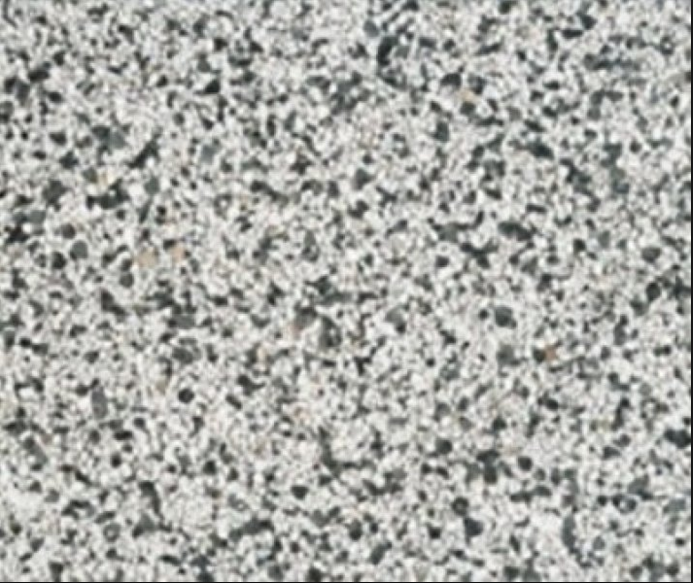

Kerstvakantie:
Omdat ik erg enthousiast was over het vak heuristieken, leek het mij leuk om een project te doen waar ik een algoritme kon implementeren. Daarom gemaild met Martijn en Daan of dat mogelijk was. Dat was mogelijk en Daan stelde voor om een rooster applicatie voor het rooster bureau van de UvA te maken. de keuze was snel gemaakt.

Week 1:
Contact opgenomen met het Rooster bureau van de UvA. Op de donderdag kon ik met Reinout (van roosterbureau) gaan zitten, zodat hij mij kon helpen met dit project (data aanleveren). In de tussentijd ben ik naar de literatuur van de algoritmiek gaan kijken. In de literatuur kwam naar voren dat een genetisch algoritme geschikt zou zijn. Dus daarom vol in de theorie van genetische algoritmes gedoken (selectie, crossover, mutatie, etc). Vrij snel bleek al dat het aardig pittige materie was dus daar heb ik flink wat tijd ingestoken. Donderdag heb ik met Reinout gezeten om de koers van het project te bepalen. Hij ging me data aanleveren van de master Physics, zodat ik met deze afgeschermde dataset me applicatie kon testen. De data had ik nu dus geregeld.

Week 2:
Begin van de week ben ik begonnen met het programmeren van het genetisch algoritme. Met heuristieken had ik ook iets met rooster gedaan, dus ik was in de veronderstelling dat ik veel van die code kon gebruiken voor dit project. Niks was minder waar. In de oude code had ik zaalslotten op meerdere plekken opgeslagen(in het rooster van de student, in het rooster van het vak, in het rooster van het lokaal).  Omdat je bij genetische algoritmes een crossover moet uitvoeren met 2 mogelijke oplossingen (roosters) is het totaal niet handig dat die tijdslotten op meerder plekken staan opgeslagen. Daarom moest ik de code strakker maken, zodat die operatie sneller kan worden uitgevoerd. Dit was een flinke klus.

Toen ik dat had gedaan kwam er al snel een tweede probleem om de hoek kijken. Als je twee roosters een crossover laat maken. Dus een deel van de eigenschappen van ouder 1 en een deel van ouder 2 in het nieuwe rooster. dan creer je ofwel dubbele colleges of dubbele zaalslotten. Om dit probleem aan te pakken twijfelde ik tussen twee opties: of het algoritme foute roosters laten creeren en hopen dat hij op de lange termijn met goede eigenschappen terug creert naar een correct rooster, of het rooster repareren tot een weer geldig rooster maar de enkele eigenschappen van de ouders weggooien. Met Daan afgesproken om dit probleem te bespreken. en samen hebben we besloten om een zogenaamde grindtegel crossover te doen. Deze grondtegel crossover heeft de eigenschap dat hij de minste reparaties nodig heeft. In het plaatje hieronder moeten de zwarte stipjes de vakken voorstellen van uder 1 op een bepaald tijdstip en de witten voor ouder 2.

Week 3:
In begin van week 3 ben ik de grindtegel crossover gaan implemeteren. Omdat de crossover vrij complex is (checken of tijdslot vrij is, als vrij dan zetten, anders andere ouder proberen, etc, etc) moest ik het allemaal strak in me hoofd houden om het algoritme juist te programmeren. Op de woensdag had ik hem af en was ik klaar om de resultaten te testen. Wat bleek het algortime leerde niet wat de goede eigenschappen waren van een rooster omdat hij zoveel moest repareren. Het algoritme deed het zelfs net zo goed als het random genereren van roosters. Om de boel te redden probeerde ik het ook met 3 of 4 ouders (omdat je dan meer sessies hebt om uit te kiezen) maar ook dit werkte niet. 

Een teleurstelling, maar goed ik moest uiteindlijk wel iets werkends afleferen dus daarom ging ik nu aan de slag met een hill_climbing algoritme. Niet degene die ik voor heuristiek heb gemaakt maar een snellere versie. net zoals met het genetisch algoritme had ik de data structuren efficienter ingericht, op die manier konden vakken snel geswitcht worden. De tijdsdruk om een werkend product af te leveren nam toe dus ik werkt het weekend door.

Week 4:
Het hillclimbing algoritme werkte nu goed. Maar ik moest de data van de master Physics nog schoonen, en de webapplicatie bouwen. Eerst heb ik een script geschreven om de data van de master Physics goed te ordenen, en in een csv file te plaatsen. Dit werkte allemaal goed en de testdata was dus goed geprepareerd. Daarna ging ik op zoek naar een manier om een simpele website te maken met python waar ik 3 csv-files kan inladen en een rooster kan weergeven. Uiteindelijk heb ik de website gebouwd met de web.py module. Waar ik 1 centraal python script heb die met een GET en een POST request verwijzen naar een html template. Tijd om de applicatie te testen. Hij werkt goed, nadat ik de files inlaad en op submit druk creert het algoritme binnen een paar seconde een conflict loos rooster voor periode 1 van de master Physiscs.

