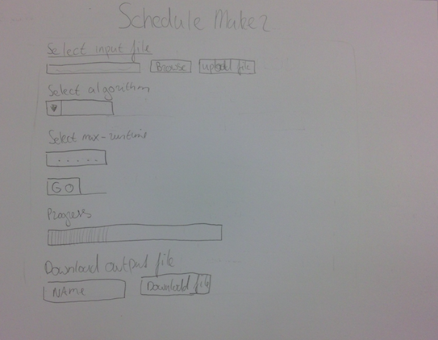

# schedule_maker
The schedule_maker creates an optimal schedule for a university by using optimization algorithms (hill-climber, simulated-annealing, genetic). The user uploads the input (students, courses, rooms, max-capacity) in csv-files, sets his desired preferences (algorithm, runtime, etc), and runs the computation. Progress of the computation is showed by a progress bar. The output of the computation is the most optimal schedule formatted in a csv-file, this file can be downloaded by the user.

The schedule_maker is build in collaboration with the schedule desk of the University of Amsterdam. Comming thursday I will meet with them to discuss further proceedings. So right now I don't know the exact functionalities of the application. This depends on the data that they can provide me. But for now I assume that the application will look like the above description.
